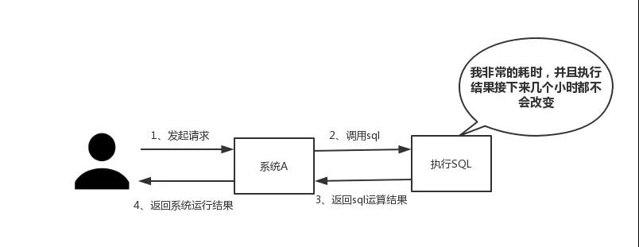

## Redis缓存

### 为什么使用redis

主要是从两个角度去考虑:**性能和并发**。当然，redis还具备可以做分布式锁等其他功能，但是如果只是为了分布式锁这些其他功能，完全还有其他中间件(如zookpeer等)代替，并不是非要使用redis。

（一）性能

如下图所示，我们在碰到需要执行耗时特别久，且结果不频繁变动的SQL，就特别适合将运行结果放入缓存。这样，后面的请求就去缓存中读取，使得请求能够迅速响应。

（二）并发

在大并发的情况下，所有的请求直接访问数据库，数据库会出现连接异常。这个时候，就需要使用redis做一个缓冲操作，让请求先访问到redis，而不是直接访问数据库。

### Redis 优缺点

#### 优点

- 读写性能优异，Redis单机最大能读的速度是每秒约10万次，单机最大能写的速度是每秒约8万次
- 支持数据持久化，支持AOF和RDB两种持久化方式
- 支持事务，Redis的所有操作都是原子性的，同时Redis还支持对几个操作合并后的原子执行
- 键值对映射存储，值类型可以是字符串、列表、散列表、集合、有序集合等五种数据结构
- 支持主从复制，进行读写分离

#### 缺点

- 受到物理内存的限制，不能用作海量数据的，因此Redis适合在数据量较小的高性能操作和运算上
- Redis不具备自动容错和恢复功能
- Redis较难支持在线扩容，

(一)缓存和数据库双写一致性问题

(二)缓存雪崩问题

(三)缓存击穿问题

(四)缓存的并发竞争问题

### 单线程的redis为什么这么快

(一)纯内存操作

(二)单线程操作，避免了频繁的上下文切换

(三)采用了非阻塞I/O多路复用机制

### redis的数据类型，以及每种数据类型的使用场景

一共五种

(一)String

这个其实没啥好说的，最常规的set/get操作，value可以是String也可以是数字。一般做一些复杂的计数功能的缓存。

(二)hash

这里value存放的是结构化的对象，比较方便的就是操作其中的某个字段。在做单点登录的时候，就是用这种数据结构存储用户信息，以cookieId作为key，设置30分钟为缓存过期时间，能很好的模拟出类似session的效果。

(三)list

使用List的数据结构，可以做简单的消息队列的功能。另外还有一个就是，可以利用lrange命令，做基于redis的分页功能，性能极佳，用户体验好。本人还用一个场景，很合适---取行情信息。就也是个生产者和消费者的场景。LIST可以很好的完成排队，先进先出的原则。

(四)set

因为set堆放的是一堆不重复值的集合。所以可以做全局去重的功能。为什么不用JVM自带的Set进行去重？因为我们的系统一般都是集群部署，使用JVM自带的Set，比较麻烦，难道做一个全局去重，再起一个公共服务，太麻烦了。

另外，就是利用交集、并集、差集等操作，可以计算共同喜好，全部的喜好，自己独有的喜好等功能。

(五)sorted set（zset）

sorted set多了一个权重参数score,集合中的元素能够按score进行排列。可以做排行榜应用，取TOP N操作。

### redis的过期策略以及内存淘汰机制

**redis采用的是定期删除+惰性删除策略。**

为什么不用定时删除策略?

定时删除,用一个定时器来负责监视key,过期则自动删除。虽然内存及时释放，但是十分消耗CPU资源。在大并发请求下，CPU要将时间应用在处理请求，而不是删除key,因此没有采用这一策略.

定期删除+惰性删除是如何工作的呢?

定期删除，redis默认每个100ms检查，是否有过期的key,有过期key则删除。需要说明的是，redis不是每个100ms将所有的key检查一次，而是随机抽取进行检查(如果每隔100ms,全部key进行检查，redis岂不是卡死)。因此，如果只采用定期删除策略，会导致很多key到时间没有删除。

于是，惰性删除派上用场。也就是说在你获取某个key的时候，redis会检查一下，这个key如果设置了过期时间那么是否过期了？如果过期了此时就会删除。

**采用定期删除+惰性删除就没其他问题了么?**

**不是的，如果定期删除没删除key。然后你也没即时去请求key，也就是说惰性删除也没生效。这样，redis的内存会越来越高。那么就应该采用内存淘汰机制。**

在redis.conf中有一行配置

\# maxmemory-policy volatile-lru

**该配置就是配内存淘汰策略的，一般使用allkeys-lru策略，当内存不足以容纳新写入数据时，在键空间中，移除最近最少使用的key**

1）noeviction：当内存不足以容纳新写入数据时，新写入操作会报错。应该没人用吧。

2）**allkeys-lru：当内存不足以容纳新写入数据时，在键空间中，移除最近最少使用的key。推荐使用，目前项目在用这种。**

3）allkeys-random：当内存不足以容纳新写入数据时，在键空间中，随机移除某个key。应该也没人用吧，你不删最少使用Key,去随机删。

4）volatile-lru：当内存不足以容纳新写入数据时，在设置了过期时间的键空间中，移除最近最少使用的key。这种情况一般是把redis既当缓存，又做持久化存储的时候才用。不推荐

5）volatile-random：当内存不足以容纳新写入数据时，在设置了过期时间的键空间中，随机移除某个key。依然不推荐

6）volatile-ttl：当内存不足以容纳新写入数据时，在设置了过期时间的键空间中，有更早过期时间的key优先移除。不推荐

ps：如果没有设置 expire 的key, 不满足先决条件(prerequisites); 那么 volatile-lru, volatile-random 和 volatile-ttl 策略的行为, 和 noeviction(不删除) 基本上一致。

### redis和数据库双写一致性问题

**一致性问题是分布式常见问题，还可以再分为最终一致性和强一致性。**数据库和缓存双写，就必然会存在不一致的问题。答这个问题，先明白一个前提。就是如果对数据有强一致性要求，不能放缓存。我们所做的一切，只能保证最终一致性。另外，我们所做的方案其实从根本上来说，只能说降低不一致发生的概率，无法完全避免。**因此，有强一致性要求的数据，不能放缓存。**

首先，采取正确更新策略，先更新数据库，再删缓存。其次，因为可能存在删除缓存失败的问题，提供一个补偿措施即可，例如利用消息队列。

**强一致性和最终一致性：**

1、强一致性：在任何时刻所有的用户或者进程查询到的都是最近一次成功更新的数据。强一致性是程度最高一致性要求，也是最难实现的。关系型数据库更新操作就是这个案例。

2、最终一致性：和强一致性相对，在某一时刻用户或者进程查询到的数据可能都不同，但是最终成功更新的数据都会被所有用户或者进程查询到。当前主流的nosql数据库都是采用这种一致性策略。

### 如何应对缓存穿透和缓存雪崩问题

**缓存穿透，即黑客故意去请求缓存中不存在的数据，导致所有的请求都怼到数据库上，从而数据库连接异常。**

解决方案:

(一)利用互斥锁，缓存失效的时候，先去获得锁，得到锁了，再去请求数据库。没得到锁，则休眠一段时间重试

(二)采用异步更新策略，无论key是否取到值，都直接返回。value值中维护一个缓存失效时间，缓存如果过期，异步起一个线程去读数据库，更新缓存。需要做缓存预热(项目启动前，先加载缓存)操作。

(三)提供一个能迅速判断请求是否有效的拦截机制，比如，利用布隆过滤器，内部维护一系列合法有效的key。迅速判断出，请求所携带的Key是否合法有效。如果不合法，则直接返回。

**缓存雪崩，即缓存同一时间大面积的失效，这个时候又来了一波请求，结果请求都怼到数据库上，从而导致数据库连接异常。**

解决方案:

(一)给缓存的失效时间，加上一个随机值，避免集体失效。

(二)同缓存穿透一样，使用互斥锁，但是该方案吞吐量明显下降了。

(三)双缓存。我们有两个缓存，缓存A和缓存B。缓存A的失效时间为20分钟，缓存B不设失效时间。自己做缓存预热操作。然后细分以下几个小点

- 从缓存A读数据，有则直接返回
- 如果A没有数据，直接从B读数据，直接返回，并且异步启动一个更新线程。
- 更新线程同时更新缓存A和缓存B。

### Redis事务

Redis事务功能是通过Multi, Exec, Discard, Watch四个原语实现的

Redis会将一个事务中的所有命令序列化，然后按顺序执行

- Redis不支持回滚，在事务失败时不进行回滚，而是继续执行余下的命令，也正因为如此Redis的内部可以保持简单且迅速
- 如果一个事务中的命令出现错误，那么所有的命令都不会执行
- 如果在一个事务中出现运行错误，那么正确的命令会被执行

### 如何解决redis的并发竞争问题

很多人会用redis事务机制，但我不推荐使用redis的事务机制。因为我们的生产环境，基本都是r**edis集群环境，做了数据分片操作。你一个事务中有涉及到多个key操作的时候，这多个key不一定都存储在同一个redis-server上。因此，redis的事务机制，十分鸡肋。**

解决方案如下：

(1)如果对这个key操作，不要求顺序

这种情况下，**准备一个分布式锁，大家去抢锁，抢到锁就做set操作即可，比较简单。**

(2)如果对这个key操作，要求顺序

假设有一个key1,系统A需要将key1设置为valueA,系统B需要将key1设置为valueB,系统C需要将key1设置为valueC.

期望按照key1的value值按照 valueA–>valueB–>valueC的顺序变化。这种时候我们在数据写入数据库的时候，需要保存一个时间戳。假设时间戳如下

系统A key 1 {valueA 3:00}

系统B key 1 {valueB 3:05}

系统C key 1 {valueC 3:10}

那么，**假设这会系统B先抢到锁，将key1设置为{valueB 3:05}。接下来系统A抢到锁，发现自己的valueA的时间戳早于缓存中的时间戳，那就不做set操作了。以此类推。**

其他方法，比如利用队列，将set方法变成串行访问也可以。总之，灵活变通。

### Redis zset的数据结构，跳跃表

redis作为一种内存KV数据库，提供了string, hash, list, set, zset等多种数据结构。其中**有序集合zset**（注意不是字典）在增删改查的性质上类似于C++ stl的map和Java的TreeMap，提供了一组“键-值”对，并且“键”按照“值”的顺序排序。但是与C++ **stl**或Java的**红黑树**实现不同的是，redis中**有序集合的实现采用了另一种数据结构——跳跃表**。跳跃表是有序单链表的一种改进，其查询、插入、删除也是O(logN)的时间复杂度。
redis选择跳跃表而非红黑树作为有序集合实现方式的原因并非是基于并发上的考虑，因为redis是单线程的，**选用跳跃表的原因仅仅是因为跳跃表的实现相较于红黑树更加简洁。**

### 如何保证redis的高可用（绝绝大多数时间服务都能对外正常提供服务）？

总的来说，就是部署redis集群，在主从同步的redis集群下如果master结点发生故障时快速进行主备切换，其中负责监听需要主备切换的是哨兵集群，采用哨兵集群进行集群的监控、消息通知、故障转移、配置主结点，哨兵本身也是分布式的集群，保障部分哨兵结点挂掉了，哨兵集群还是能正常工作，这是非常重要的。

**主备切换**

　　在master故障时，自动检测，将某个slave切换为master的过程，叫做主备切换。这个过程，实现了Redis主从架构下的高可用性。

**哨兵是redis集群架构中非常重要的一个组件，主要功能如下**

　　集群监控，负责监控redis master和slave进程是否正常工作
　　消息通知，如果某个redis实例有故障，那么哨兵负责发送消息作为报警通知给管理员
　　故障转移，如果master node挂掉了，会自动转移到slave node上
　　配置中心，如果故障转移发生了，通知client客户端新的master地址

**哨兵本身也是分布式的，作为一个哨兵集群去运行，互相协同工作**

　　故障转移时，判断一个master node是宕机了，需要大部分的哨兵都同意才行，涉及到了分布式选举的问题
　　即使部分哨兵节点挂掉了，哨兵集群还是能正常工作的，因为如果一个作为高可用机制重要组成部分的故障转移系统本身是单点的，那就很坑爹了

**哨兵的核心知识**

　　哨兵至少需要3个实例，来保证自己的健壮性
　　哨兵 + redis主从的部署架构，是不会保证数据零丢失的，只能保证redis集群的高可用性
　　对于哨兵 + redis主从这种复杂的部署架构，尽量在测试环境和生产环境，都进行充足的测试和演练

### Redis分区

分区可以让Redis管理不同机器上的内存而不限制于单台机器的内存

#### 实现方案

- 客户端分区：客户端就已经决定数据会被存储到哪个Redis节点或者从哪个Redis节点读取
- 代理分区：代理根据分区规则决定请求实际的请求Redis实例（一种代理实现Twemproxy）
- 查询路由：客户端随机的请求任意一个Redis实例，然后由Redis将请求转发给正确的Redis节点

#### Redis分区带来的缺点

- 涉及 多个Key的操作通常不会被支持，例如不能直接对两个集合求交集，因为他们可能被存储到不同的实例上
- 同时操作多个Key, 则不能使用Redis事务
- 分区使用的粒度是Key，不能使用一个非常长的排序Key存储一个数据集
- 当使用分区的时候，数据处理会非常复杂，例如为了备份你必须从不同的Redis实例和主机同时收集RDB/AOF文件
- 分区时动态扩容或缩容可能非常复杂

### Redis分布式锁条件

首先，为了确保分布式锁可用，我们至少要确保锁的实现同时满足以下四个条件：

1. **互斥性**。在任意时刻，只有一个客户端能持有锁。
2. **不会发生死锁**。即使有一个客户端在持有锁的期间崩溃而没有主动解锁，也能保证后续其他客户端能加锁。
3. **具有容错性**。只要大部分的Redis节点正常运行，客户端就可以加锁和解锁。
4. **解铃还须系铃人**。加锁和解锁必须是同一个客户端，客户端自己不能把别人加的锁给解了.

### RedLock

基于Redis实现分布式锁的方式我们成为RedLock

### Redis实现数据持久化

由于Redis的数据都存放在内存中，如果没有配置持久化，redis重启后数据就全丢失了，于是需要开启redis的持久化功能，将数据保存到磁盘上，当redis重启后，可以从磁盘中恢复数据。

redis提供两种方式进行持久化

一种是**RDB持久化（原理是将Redis在内存中的数据库记录定时dump到磁盘上的RDB持久化）**.RDB持久化是指在指定的时间间隔内将内存中的数据集快照写入磁盘，实际操作过程是fork一个子进程，先将数据集写入临时文件，写入成功后，再替换之前的文件，用二进制压缩存储。

另外一种是**AOF（append only file）持久化（原理是将Redis的操作日志以追加的方式写入文件）。AOF持久化以日志的形式记录服务器所处理的每一个写、删除操作，查询操作不会记录，以文本的方式记录，可以打开文件看到详细的操作记录。**

**RDB存在哪些优势呢？**

1). 一旦采用该方式，那么你的整个Redis数据库将只包含一个文件，这对于**文件备份而言是非常完美的**。比如，你可能打算每个小时归档一次最近24小时的数据，同时还要每天归档一次最近30天的数据。通过这样的备份策略，**一旦系统出现灾难性故障，我们可以非常容易的进行恢复。**

2). 性能最大化。对于Redis的服务进程而言，在开始持久化时，它唯一需要做的只是fork出子进程，之后再由子进程完成这些持久化的工作，这样就可以极大的避免服务进程执行IO操作了。

4). 相比于AOF机制，如果数据集很大，RDB的启动效率会更高。

**RDB又存在哪些劣势呢？**

1). 如果你想保证数据的高可用性，即最大限度的避免数据丢失，那么RDB将不是一个很好的选择。因为系统一旦在定时持久化之前出现宕机现象，此前没有来得及写入磁盘的数据都将丢失。

2). 由于RDB是通过fork子进程来协助完成数据持久化工作的，因此，如果当数据集较大时，可能会导致整个服务器停止服务几百毫秒，甚至是1秒钟。

**AOF的优势有哪些呢？**

1**). 该机制可以带来更高的数据安全性，即数据持久性。**Redis中提供了3中同步策略，即每秒同步、每修改同步和不同步。事实上，每秒同步也是异步完成的，其效率也是非常高的，所差的是一旦系统出现宕机现象，那么这一秒钟之内修改的数据将会丢失。而每修改同步，我们可以将其视为同步持久化，即每次发生的数据变化都会被立即记录到磁盘中。可以预见，这种方式在效率上是最低的。至于无同步，无需多言，我想大家都能正确的理解它。

**2). 由于该机制对日志文件的写入操作采用的是append模式，因此在写入过程中即使出现宕机现象，也不会破坏日志文件中已经存在的内容。**然而如果我们本次操作只是写入了一半数据就出现了系统崩溃问题，不用担心，在Redis下一次启动之前，我们可以通过redis-check-aof工具来帮助我们解决数据一致性的问题。

3). **如果日志过大，Redis可以自动启用rewrite机制。即Redis以append模式不断的将修改数据写入到老的磁盘文件中，同时Redis还会创建一个新的文件用于记录此期间有哪些修改命令被执行。**因此在进行rewrite切换时可以更好的保证数据安全性。

4). **AOF包含一个格式清晰、易于理解的日志文件用于记录所有的修改操作。**事实上，我们也可以通过该文件完成数据的重建。

**AOF的劣势有哪些呢？**

1). **对于相同数量的数据集而言，AOF文件通常要大于RDB文件。RDB 在恢复大数据集时的速度比 AOF 的恢复速**度要快。

2). 根据同步策略的不同，AOF在运行效率上往往会慢于RDB。总之，每秒同步策略的效率是比较高的，同步禁用策略的效率和RDB一样高效。

二者选择的标准，就是看系统是**愿意牺牲一些性能，换取更高的缓存一致性（aof）**，还是愿意写操作频繁的时候，不启用备份来换取更高的性能，待手动运行save的时候，再做备份（rdb）。rdb这个就更有些 eventually consistent的意思了。

### redis缓存，本地缓存

1. 读写速度，不考虑并发问题，本地缓存自然是最快的。但是如果本地缓存不加锁，那应并发了咋办呢？所以，我们以加锁方式再比较一次。
2. 场景使用，同一数据，从数据库取出来，放到redis只要一次，而放到本地缓存，则需要n个集群次
3. 本地缓存无法用于重复点击，重复点击会分发请求到多台服务器，而用本地缓存只能防止本机重复点击，redis则可以防止，但是时间间隔也需要在redis的读写差之外。
4. **redis内存可能n多扩充，而本地扩大堆内存代价是很大的。**
5. 本地缓存需要自己实现过期功能，实现不好可能导致极其严重的后果，而redis经过大量的流量验证，许多漏洞无需考试，安全。
6. 本地缓存无法提供丰富的数据结构，redis可以。
7. **redis可以写磁盘，持久化，本地缓存不可以或者说很麻烦要考虑的东西太多。**
8. 各位开发同学水平差别大，使用本地缓存极有可能导致严重的线程安全问题，并发考虑严重。
9. 加本地缓存后，代码复杂度急剧上升，后面进来的开发很难一下领会原有开发想法。间接提升维护成本。