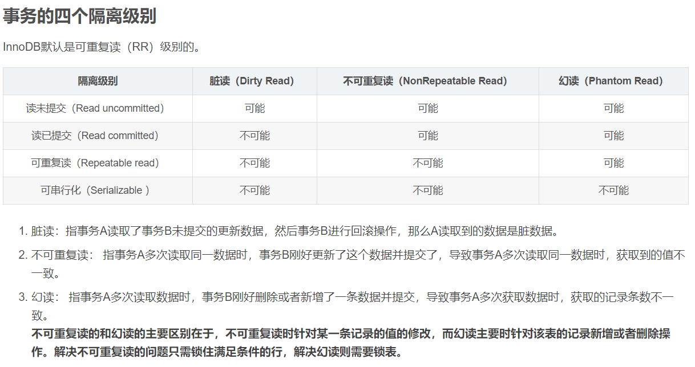
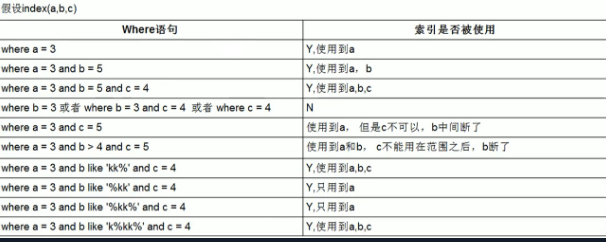

## 一、MYSQL 
### 【高频】索引
索引使用B+树结构，而不是红黑树 ： {  磁盘预读取使一个结点对应申请一个磁盘页 、红黑树高度太大 }

在大规模数据存储的时候，红黑树往往出现由于树的深度过大而造成磁盘IO读写过于频繁，进而导致效率低下的情况。所以一般红黑树和AVL二叉平衡查找树是内存中使用的数据结构。

【高频】mysql索引为什么使用B+树而不是 B 树？

1. b+树的数据都集中在叶子结点，分支结点只负责索引，而b树的分支结点也有数据域，
2. b+树的层高较小，平均的IO次数少于B树，减少查询时间开销
3. B+树擅长范围查询，叶子结点数据是按顺序存储在双向链表中，B树范围查询只能中序遍历

### 两种引擎之间的区别：

InnoDB：

（1）具有事务(commit)、回滚(rollback)和崩溃修复能力(crash recovery capabilities)的事务安全(transaction-safe (ACID compliant))型表。

（2）支持外键，支持MVVC基于多版本的并发控制协议，不支持全文索引。

（3）InnoDB 中不保存表的具体行数，也就是说，执行select count(*) from table时，InnoDB要扫描一遍整个表来计算有多少行。注意的是，当count(*)语句包含 where条件时，两种表的操作是一样的。

（4）对于AUTO_INCREMENT类型的字段，InnoDB中必须包含只有该字段的索引。

（5）DELETE FROM table时，InnoDB不会重新建立表，而是一行一行的删除。

MyISAM：

（1）不支持事务操作，非事务安全的。

（2）不支持外键，不支持MVVC，支持全文索引，

（3）MyISAM保存表的具体行数，执行select count(*) from table时只要简单的读出保存好的行数即可。

（4）对于AUTO_INCREMENT类型的字段，在MyISAM表中，可以和其他字段一起建立联合索引。

（5）MyISAM存储引擎的读锁和写锁是互斥的，读写操作是串行的。那么，一个进程请求某个MyISAM表的读锁，同时另一个进程也请求同一表的写锁，MySQL如何处理呢？答案是写进程先获得锁。不仅如此，即使读请求先到锁等待队列，写请求后到，写锁也会插到读锁请求之前！这是因为MySQL认为写请求一般比读请求要重要。这也正是MyISAM表不太适合于有大量更新操作和查询操作应用的原因，因为，大量的更新操作会造成查询操作很难获得读锁，从而可能永远阻塞。这种情况有时可能会变得非常糟糕！

### 什么是事务?

事务是应用程序中一系列严密的操作，用来保证数据库的完整性。

MySQL中只有使用了 Innodb 数据库引擎的数据库或表才支持事务。

mysql默认自动提交事务。

### 事务特性ACID

四个特性：原子性（ Atomicity ）、一致性（ Consistency ）、隔离性（ Isolation ）和持续性（ Durability ）。简称为 ACID 。

注意：这里原子性跟一致性需要注意的是：原子性关注状态，要么全部成功，要么全部失败，不存在部分成功的状态。而一致性关注数据的可见性，中间状态的数据对外部不可见，只有最初状态和最终状态的数据对外可见。

### 并发事务带来的问题

### mysql日志系统：
#### binlog
binlog 用于记录数据库执行的写入性操作(不包括查询)信息，以二进制的形式保存在磁盘中。binlog 是 mysql的逻辑日志，并且由 Server 层进行记录，使用任何存储引擎的 mysql 数据库都会记录 binlog 日志。

逻辑日志：可以简单理解为记录的就是sql语句 。

物理日志：mysql 数据最终是保存在数据页中的，物理日志记录的就是数据页变更 。

binlog 是通过追加的方式进行写入的，可以通过max_binlog_size 参数设置每个 binlog文件的大小，当文件大小达到给定值之后，会生成新的文件来保存日志。

binlog使用场景
在实际应用中， binlog 的主要使用场景有两个，分别是 主从复制 和 数据恢复 。

主从复制 ：在 Master 端开启 binlog ，然后将 binlog发送到各个 Slave 端， Slave 端重放 binlog 从而达到主从数据一致。

数据恢复 ：通过使用 mysqlbinlog 工具来恢复数据。

#### redo log
只记录事务对数据页做了哪些修改, 性能提升，mysql对数据的修改不是马上执行的，会写入os buffer然后再刷新进入磁盘。通过redo log实现崩溃修复。
#### undo log
回滚，实现原子性。

### 乐观锁和悲观锁
悲观锁
悲观锁（Pessimistic Lock），顾名思义，就是很悲观，每次去拿数据的时候都认为别人会修改，所以每次在拿数据的时候都会上锁，这样别人想拿这个数据就会block直到它拿到锁。

悲观锁：假定会发生并发冲突，屏蔽一切可能违反数据完整性的操作。

Java synchronized 就属于悲观锁的一种实现，每次线程要修改数据时都先获得锁，保证同一时刻只有一个线程能操作数据，其他线程则会被block。

乐观锁
乐观锁（Optimistic Lock），顾名思义，就是很乐观，每次去拿数据的时候都认为别人不会修改，所以不会上锁，但是在提交更新的时候会判断一下在此期间别人有没有去更新这个数据。乐观锁适用于读多写少的应用场景，这样可以提高吞吐量。

乐观锁：假设不会发生并发冲突，只在提交操作时检查是否违反数据完整性。

### 聚簇索引和非聚簇索引区别, 主键索引和二级索引
聚簇索引(也称为主键索引)就是携带了行数据的索引,非聚簇索引就是除了聚簇索引之外的索引。因此非聚簇索引查询数据需要先查到聚簇索引的key,然后用这个key去查询真正的数据(这个过程称为回表)。所以能走聚簇索引的尽量走聚簇索引(也可以说是尽量走主键),看起来都是走索引,实际上主键要更快。但是如果要查询的字段, 数据直接就在索引上是可以不需要回表的.这种索引称为覆盖索引。
主键上的索引称为主键索引，其他索引为二级索引。

### explain中 rows type key extra字段的含义？
explain只能解释select语句

rows：sql查询时估算的要检查的行数

type：联接类型

key：显示MySQL在查询中实际使用的索引，若没有使用索引，显示为NULL

extra：包含MySQL解决查询的详细信息

### count(1) count(*) count(列值)的区别
count(1): 统计表中的所有的记录数，包含字段为null 的记录。

count(*):包括了所有的列，相当于行数，在统计结果的时候，不会忽略列值为NULL  

count(某一列)：只包括列名那一列，在统计结果的时候，会忽略列值为空（这里的空不是只空字符串或者0，而是表示null）的计数，即某个字段值为NULL时，不统计。

列名为主键，count(列名)会比count(1)快  

列名不为主键，count(1)会比count(列名)快  

如果表多个列并且没有主键，则 count（1） 的执行效率优于 count（*）  

如果有主键，则 select count（主键）的执行效率是最优的  

如果表只有一个字段，则 select count（*）最优。

### 联合索引在where条件中的不同作用情况

总的来说，对于联合索引，如果没有使用到第一个字段的话是不会使用索引来优化查询的，同时，对于字段的模糊匹配时，通配符不能出现在首部。

### 主从同步策略有哪些，insert到master是等同步完成再响应还是？

#### 1.半同步复制

办法就是等主从同步完成之后，等主库上的写请求再返回，这就是常说的“半同步复制”。

实现方案

MySQL的Replication默认是一个异步复制的过程，从MySQL5.5开始，MySQL以插件的形式支持半同步复制，我先谈下异步复制，这样可以更好的理解半同步复制。

1）异步复制

MySQL默认的复制是异步的，主库在执行完客户端提交的事务后会立即将结果返给给客户端，并不关心从库是否已经接收并处理，这样就会有一个问题，主如果crash掉了，此时主上已经提交的事务可能并没有传到从库上。

2）半同步复制

介于异步复制和全同步复制之间，主库在执行完客户端提交的事务后不是立刻返回给客户端，而是等待至少一个从库接收到并写到relay
log中才返回给客户端。相对于异步复制，半同步复制提高了数据的安全性，同时它也造成了一定程度的延迟，这个延迟最少是一个TCP/IP往返的时间。所以，半同步复制最好在低延时的网络中使用。

半同步复制原理：

事务在主库写完binlog后需要从库返回一个已接受，才放回给客户端。
mysql5.5版本以后，以插件的形式存在，需要单独安装，确保事务提交后binlog至少传输到一个从库，不保证从库应用完成这个事务的binlog。性能有一定的降低，网络异常或从库宕机，卡主库，直到超时或从库恢复。
该方案优点：利用数据库原生功能，比较简单

该方案缺点：主库的写请求时延会增长，吞吐量会降低

2.数据库中间件

流程：

1）所有的读写都走数据库中间件，通常情况下，写请求路由到主库，读请求路由到从库

2）记录所有路由到写库的key，在主从同步时间窗口内（假设是500ms），如果有读请求访问中间件，此时有可能从库还是旧数据，就把这个key上的读请求路由到主库。

3）在主从同步时间过完后，对应key的读请求继续路由到从库。
insert等增删改到master是等同步完成再响应还是怎样，是我们采取的同步策略来决定的，当然一般情况下是同步完成再响应，可以采用数据中间件的解决方案。

### 慢查询SQL

