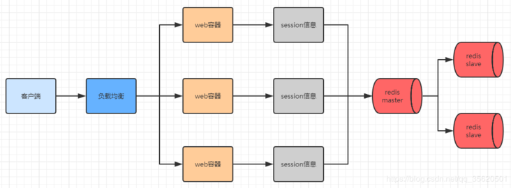

## 如何实现分布式session

### cookie和session的区别和联系

cookie是本地客户端用来存储少量数据信息的，保存在客户端，用户能够很容易的获取，安全性不高，存储的数据量小
session是服务器用来存储部分数据信息，保存在服务器，用户不容易获取，安全性高，储存的数据量相对大，存储在服务器，会占用一些服务器资源

sessionid需要存储在客户端的cookie上，要依赖客户端cookie。

### session有什么用

在一次客户端和服务器为之间的会话中，客户端(浏览器)向服务器发送请求，首先cookie会自动携带上次请求存储的数据(JSESSIONID)到服务器，服务器根据请求参数中的SESSIONID到服务器中的session库中查询是否存在此SESSIONID的信息，如果存在，那么服务器就知道此用户是谁，如果不存在，就会创建一个SESSIONID，并在本次请求结束后将SESSIONID返回给客户端，同时将此SESSIONID在客户端cookie中进行保存

客户端和服务器之间是通过http协议进行通信，但是http协议是无状态的，不同次请求会话是没有任何关联的，但是优点是处理速度快

session是一次浏览器和服务器的交互的会话，当浏览器关闭的时候，会话就结束了，但是会话session还在，默认session是还保留30分钟的

### 分布式session一致性

客户端发送一个请求，经过负载均衡后该请求会被分配到服务器中的其中一个，由于不同服务器含有不同的web服务器(例如Tomcat)，不同的web服务器中并不能发现之前web服务器保存的session信息，就会再次生成一个SESSIONID，之前的状态就会丢失

### 方案一：session复制

session复制是小型企业应用使用较多的一种**服务器集群session管理机制**，在真正的开发使用的并不是很多，通过对web服务器(例如Tomcat)进行搭建集群。

**存在的问题**

- session同步的原理是在同一个局域网里面通过发送广播来异步同步session的，一旦服务器多了，并发上来了，session需要同步的数据量就大了，需要将其他服务器上的session全部同步到本服务器上，会带来一定的网路开销，在用户量特别大的时候，会出现内存不足的情况

**优点：**

- 服务器之间的session信息都是同步的，任何一台服务器宕机的时候不会影响另外服务器中session的状态，配置相对简单
- Tomcat内部已经支持分布式架构开发管理机制，可以对tomcat修改配置来支持session复制，在集群中的几台服务器之间同步session对象，使每台服务器上都保存了所有用户的session信息，这样任何一台本机宕机都不会导致session数据的丢失，而服务器使用session时，也只需要在本机获取即可

**如何配置：**

在Tomcat安装目录下的config目录中的server.xml文件中，将注释打开，tomcat必须在同一个网关内，要不然收不到广播，同步不了session

在web.xml中开启session复制：`<distributable/>`

### 方案二：session绑定：

#### Nginx介绍：

Nginx是一款自由的、开源的、高性能的http服务器和反向代理服务器

#### Nginx能做什么：

反向代理、负载均衡、http服务器（动静代理）、正向代理

#### 如何使用nginx进行session绑定

我们利用nginx的反向代理和负载均衡，之前是客户端会被分配到其中一台服务器进行处理，具体分配到哪台服务器进行处理还得看服务器的负载均衡算法(轮询、随机、ip-hash、权重等)，但是我们可**以基于nginx的`ip-hash策略`，可以对客户端和服务器进行绑定，同一个客户端就只能访问该服务器，无论客户端发送多少次请求都被同一个服务器处理**

在nginx安装目录下的conf目录中的nginx.conf文件

```
upstream aaa {  
    Ip_hash;  
    server 39.105.59.4:8080;  
    Server 39.105.59.4:8081;  
}  
server {  
listen80;  
    server_name www.wanyingjing.cn;  
#root /usr/local/nginx/html;  
#index index.html index.htm;  
    location / {  
        proxy_pass http:39.105.59.4;  
index index.html index.htm;  
    }  
}
```

**缺点：**

- **容易造成单点故障，如果有一台服务器宕机，那么该台服务器上的session信息将会丢失**
- 前端不能有负载均衡，如果有，session绑定将会出问题

**优点：**

- 配置简单

### 方案三：基于redis存储session方案

**基于redis存储session方案流程示意图**



**引入pom依赖：**

```
<dependency>    
   <groupId>org.springframework.boot</groupId>    
   <artifactId>spring-session-data-redis</artifactId>
</dependency>
<dependency>    
   <groupId>org.springframework.boot</groupId>    
   <artifactId>spring-boot-data-starter-redis</artifactId>
</dependency>
```

**配置redis**

```
#redis数据库索引(默认是0)
spring.redis.database=0
spring.redis.host=127.0.0.1
spring.redis.port=6379
#默认密码为空
spring.redis.password=
#连接池最大连接数(负数表示没有限制)
spring.redis.jedis.pool.max-active=1000
#连接池最大阻塞等待时间(负数表示没有限制)
spring.redis.jedis.pool.max-wait=-1ms
#连接池中的最大空闲连接
spring.redis.jedis.pool.max-idle=10
#连接池中的最小空闲连接
spring.redis.jedis.pool.min-idle=2
#连接超时时间(毫秒)
spring.redis.timeout=500ms
```

**优点：**

- 这是企业中使用的最多的一种方式
- 数据保存在redis中，无缝接入，不存在任何安全隐患
- redis自身可做集群，搭建主从，同时方便管理

**缺点：**

- 多了一次网络调用，web容器需要向redis访问

### 总结

一般会将web容器所在的服务器和redis所在的服务器放在同一个机房，减少网络开销，走内网进行连接 

   