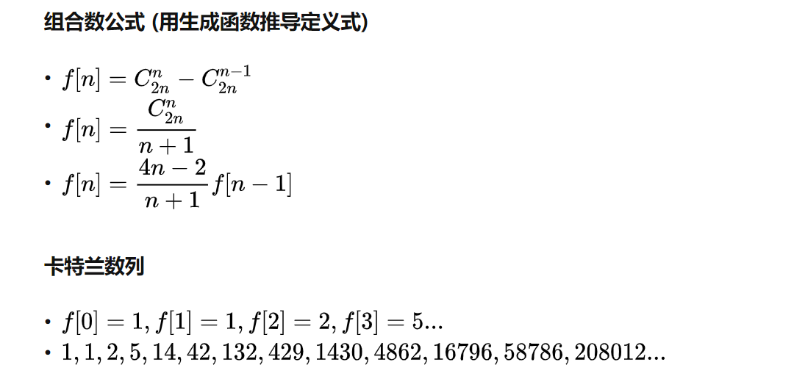

## 左叶子结点和

```python
class Solution:
    def sumOfLeftLeaves(self, root: TreeNode) -> int:
        isLeafNode = lambda node: not node.left and not node.right
        def dfs(node: TreeNode) -> int:
            ans = 0
            if node.left:
                ans += node.left.val if isLeafNode(node.left) else dfs(node.left)
            if node.right and not isLeafNode(node.right):
                ans += dfs(node.right)
            return ans
        
        return dfs(root) if root else 0
```

## 求根节点到叶节点数字之和

给你一个二叉树的根节点 root ，树中每个节点都存放有一个 0 到 9 之间的数字。
每条从根节点到叶节点的路径都代表一个数字：

例如，从根节点到叶节点的路径 1 -> 2 -> 3 表示数字 123 。
计算从根节点到叶节点生成的 所有数字之和 。

叶节点 是指没有子节点的节点。

```python
# Definition for a binary tree node.
# class TreeNode:
#     def __init__(self, val=0, left=None, right=None):
#         self.val = val
#         self.left = left
#         self.right = right
class Solution:
    def sumNumbers(self, root: TreeNode) -> int:
        arr = []
        def recursion(curr: TreeNode, pre: int):
            if not curr.left and not curr.right:
                arr.append(pre * 10 + curr.val)
                return
            if curr.left:
                recursion(curr.left, pre * 10 + curr.val)
            if curr.right:
                recursion(curr.right, pre * 10 + curr.val)
        recursion(root, 0)  # 注意根节点之前的pre是0
        return sum(arr)
```

## 二叉树前序遍历与中序遍历结果构造二叉树

```python
class Solution:
    def buildTree(self, preorder: List[int], inorder: List[int]) -> TreeNode:
        def myBuildTree(preorder_left: int, preorder_right: int, inorder_left: int, inorder_right: int):
            if preorder_left > preorder_right:
                return None
            
            # 前序遍历中的第一个节点就是根节点
            preorder_root = preorder_left
            # 在中序遍历中定位根节点
            inorder_root = index[preorder[preorder_root]]
            
            # 先把根节点建立出来
            root = TreeNode(preorder[preorder_root])
            # 得到左子树中的节点数目
            size_left_subtree = inorder_root - inorder_left
            # 递归地构造左子树，并连接到根节点
            # 先序遍历中「从 左边界+1 开始的 size_left_subtree」个元素就对应了中序遍历中「从 左边界 开始到 根节点定位-1」的元素
            root.left = myBuildTree(preorder_left + 1, preorder_left + size_left_subtree, inorder_left, inorder_root - 1)
            # 递归地构造右子树，并连接到根节点
            # 先序遍历中「从 左边界+1+左子树节点数目 开始到 右边界」的元素就对应了中序遍历中「从 根节点定位+1 到 右边界」的元素
            root.right = myBuildTree(preorder_left + size_left_subtree + 1, preorder_right, inorder_root + 1, inorder_right)
            return root
        
        n = len(preorder)
        # 构造哈希映射，帮助我们快速定位根节点
        index = {element: i for i, element in enumerate(inorder)}
        return myBuildTree(0, n - 1, 0, n - 1)
```

## 二叉树前中后序遍历，层序遍历

```python
import copy
class node:
    def __init__(self, val):
        self.val = val
        self.left = None
        self.right = None

# 简单的非递归实现二叉树的前序遍历  root -> left -> right
def preOrder_easy(root):
    res, stack = [], [root]
    while stack:
        root = stack.pop()
        if type(root) is node:
            if root.right:
                stack.append(root.right)
            if root.left:
                stack.append(root.left)
            stack.append(root.val)
        else:
            res.append(root)
    return res

preOrder_easy(copy.deepcopy(root))

# 后序遍历的非递归实现  left -> right -> root
def postOrder_easy(root):
    res, stack = [], [root]
    while stack:
        root = stack.pop()
        if type(root) is node:
            stack.append(root.val)
            if root.right:
                stack.append(root.right)
            if root.left:
                stack.append(root.left)
        else:
            res.append(root)
    return res
postOrder_easy(copy.deepcopy(root))

# 中序遍历非递归的简单实现   left -> root -> right
def inOrder_easy(root):
    res, stack = [], [root]
    while stack:
        root = stack.pop()
        if type(root) is node:
            if root.right:
                stack.append(root.right)
            stack.append(root.val)
            if root.left:
                stack.append(root.left)
        else:
            res.append(root)
    return res
inOrder_easy(copy.deepcopy(root))

# 层序遍历非递归实现记得不是采用栈而是采用队列，先进先出的数据结构，这样都是从左往右一层一层打印
def leverOrder_easy(root):
    res, queue = [], [root]
    while queue:
        curr = queue.pop(0)
        res.append(curr.val)
        if curr.left:
            queue.append(curr.left)
        if curr.right:
            queue.append(curr.right)
    return ans

# 递归实现最为简单，根据出现的顺序递归就好了，反而上面的栈实现主要栈是后进先出所以顺序要反过来
def preOrder_recur(root):
    if not root:
        return []
    return preOrder_recur(root.val) + preOrder_recur(root.left) + preOrder_recur(root.right)

def inOrder_recur(root):
    if not root:
        return []
    return inOrder_recur(root.left) + [root.val] + inOrder_recur(right)

def postOrder_recur(root):
    if not root:
        return []
    return postOrder_recur(root.left) + postOrder_recur(root.right) + postOrder_recur(root.val)

def levelOrder_recur(root):
    ans = [[]]  # 初始化时候就要添加一个二级列表，这样新层的第一个元素的值就有空间可以存储，相应的返回答案的时候不要最后一行
    def recursion(curr, level):
        if not curr:
            return 
        else:
            ans[level-1].append(curr.val)
            if len(ans) == level:
                ans.append([])  # 为下一层准备
            recursion(curr.left, level+1)  # 不用判断是否存在子结点再递归，递归的时候会先判断的
            recursion(curr.right, level+1)
    recursion(root, 1)
    return ans[:-1]
```

## 二叉树的锯齿形层序遍历

给定一个二叉树，返回其节点值的锯齿形层序遍历。（即先从左往右，再从右往左进行下一层遍历，以此类推，层与层之间交替进行）。

```python
class Solution:
    def zigzagLevelOrder(self, root: TreeNode) -> List[List[int]]:
        if not root: return []
        stack = [root]
        stack1 = []
        ans = []
        def levelOrder(level):
            temp = []
            nonlocal stack, stack1, ans
            while stack:
                curr = stack.pop()
                temp.append(curr.val)
                if level % 2 == 1:
                    if curr.left:
                        stack1.append(curr.left)
                    if curr.right:
                        stack1.append(curr.right)
                else:
                    if curr.right:
                        stack1.append(curr.right)
                    if curr.left:
                        stack1.append(curr.left)
            if not temp:
                return 
            else:
                ans.append(temp)
                stack, stack1 = stack1, stack
            levelOrder(level + 1)
        levelOrder(1)
        return ans
```

## 二叉树转链表

```python
给定一个二叉树，原地将它展开为一个单链表。
例如，给定二叉树

    1
   / \
  2   5
 / \   \
3   4   6
将其展开为：
1\2\3\4\5\6
可以发现顺序刚好是二叉树的前序遍历顺序，前序遍历先访问左子树，所以不能将左指针用来连接链表，于是采用右指针来当做链表的指针
然后非递归实现的时候，先入右结点，这样的话刚好右指针被保存起来，用来链接连接链表，所以前序遍历非递归实现刚好可以原地将二叉树转为单链表
# 存一个辅助结点来表示上一个结点，这样遍历到下一个结点的时候可以让上一个结点的右指针指向自己
helpNode = None
def binTree_link(root):
    stack = [root]
    while stack:
        curr = stack.pop()
        if curr.right:
            stack.append(curr.right)
        if curr.left:
            stack.append(curr.left)
        if helpNode:
            helpNode.right = curr
            helpNode.left = None
        helpNode = curr
    return root
```

## LRU替换算法实现

字典+双向链表实现

字典KV对应key，value存储的不是真正的值，而是对应在双向链表中的结点，结点再存储真正的val值。

## 卡特兰数



### 经典的卡特兰数问题

### 括号匹配问题

- ![[公式]](https://www.zhihu.com/equation?tex=n) 个左括号， ![[公式]](https://www.zhihu.com/equation?tex=n) 个右括号，对于每一个位置，左括号数大于等于右括号数的方案总数。

- 等价于 ![[公式]](https://www.zhihu.com/equation?tex=n) 个 ![[公式]](https://www.zhihu.com/equation?tex=1) ， ![[公式]](https://www.zhihu.com/equation?tex=n) 个 ![[公式]](https://www.zhihu.com/equation?tex=-1) ，每个位置前缀和大于等于 ![[公式]](https://www.zhihu.com/equation?tex=0) 的方案总数。

- 两种理解方向：

- - ![[公式]](https://www.zhihu.com/equation?tex=f%5Bn%5D%3D%5Csum%5Climits_%7Bi%3D0%7D%5E%7Bn-1%7Df%5Bi%5Df%5Bn-1-i%5D)*。*枚举第一次前缀和为 ![[公式]](https://www.zhihu.com/equation?tex=0) 的位置，假如第 ![[公式]](https://www.zhihu.com/equation?tex=2x) 个点为第一次前缀和为 ![[公式]](https://www.zhihu.com/equation?tex=0) 的点，则固定第一个数为 ![[公式]](https://www.zhihu.com/equation?tex=1) ，第 ![[公式]](https://www.zhihu.com/equation?tex=x) 个数为 ![[公式]](https://www.zhihu.com/equation?tex=-1) ，则对答案贡献为 ![[公式]](https://www.zhihu.com/equation?tex=f%5Bx-1%5D%2Af%5Bn-x%5D) 。
  - ![[公式]](https://www.zhihu.com/equation?tex=f%5Bn%5D%3DC_%7B2n%7D%5En-C_%7B2n%7D%5E%7Bn-1%7D) 。总方案数为 ![[公式]](https://www.zhihu.com/equation?tex=C_%7B2n%7D%5En) ，现需求不符合条件的方案数，将问题转化为网格上的折线问题。第 ![[公式]](https://www.zhihu.com/equation?tex=i) 次在 ![[公式]](https://www.zhihu.com/equation?tex=%28i%2Cj%29) 处，第 ![[公式]](https://www.zhihu.com/equation?tex=i%2B1) 次在 ![[公式]](https://www.zhihu.com/equation?tex=%28i%2B1%2Cj%2B1%29) 或 ![[公式]](https://www.zhihu.com/equation?tex=%28i%2B1%2Cj-1%29) 处，终点为 ![[公式]](https://www.zhihu.com/equation?tex=%282n%2C0%29) 。不符合条件则说明折线上出现了 ![[公式]](https://www.zhihu.com/equation?tex=%28x%2C-1%29) 这个点， ![[公式]](https://www.zhihu.com/equation?tex=x) 为第一次到达 ![[公式]](https://www.zhihu.com/equation?tex=-1) 的点，我们将 ![[公式]](https://www.zhihu.com/equation?tex=x) 点之后的折线沿 ![[公式]](https://www.zhihu.com/equation?tex=y%3D-1) 对称过来，则终点为 ![[公式]](https://www.zhihu.com/equation?tex=%282n%2C-2%29) ，则一共有 ![[公式]](https://www.zhihu.com/equation?tex=n-1) 个 ![[公式]](https://www.zhihu.com/equation?tex=1) ， ![[公式]](https://www.zhihu.com/equation?tex=n%2B1) 个 ![[公式]](https://www.zhihu.com/equation?tex=-1) ，即不合法的方案总数为 ![[公式]](https://www.zhihu.com/equation?tex=C_%7B2n%7D%5E%7Bn-1%7D) ，因此 ![[公式]](https://www.zhihu.com/equation?tex=f%5Bn%5D%3DC_%7B2n%7D%5En-C_%7B2n%7D%5E%7Bn-1%7D) 。


### 出栈次序问题

- 一个无穷大的栈，进栈序列为 ![[公式]](https://www.zhihu.com/equation?tex=1%2C2%2C3...n) ，求有多少个不同的出栈序列。

### 多边划分为三角形问题

- 将一个凸多边形区域分成三角形区域的方案数。
- 在圆上选择 ![[公式]](https://www.zhihu.com/equation?tex=2%2An) 个点，将这些点对连接起来使得所得到的 ![[公式]](https://www.zhihu.com/equation?tex=n) 条线段不想交的方案数。

### 二叉树计数问题

- 给定 ![[公式]](https://www.zhihu.com/equation?tex=n) 个节点，能构成多少种形状不同的二叉树。
- 先取一个点作为顶点，然后左边依次可以取 ![[公式]](https://www.zhihu.com/equation?tex=0%EF%BD%9En-1) 个点，右边则可以取 ![[公式]](https://www.zhihu.com/equation?tex=n-1%EF%BD%9E0) 个点，相乘再累加即可得到答案。

## 海盗分金问题

经济学上有个“海盗分金”模型：是说5个[海盗](https://baike.baidu.com/item/海盗/161939)抢得100枚金币，他们按抽签的顺序依次提方案：首先由1号提出分配方案，然后5人表决，投票要超过半数同意方案才被通过，否则他将被扔入大海喂鲨鱼，依此类推。“海盗分金”其实是一个高度简化和[抽象](https://baike.baidu.com/item/抽象/82058)的模型，体现了[博弈](https://baike.baidu.com/item/博弈/74592)的思想。在“海盗分金”模型中，任何“分配者”想让自己的方案获得通过的关键是事先考虑清楚“挑战者”的分配方案是什么，并用最小的代价获取最大收益，拉拢“挑战者”分配方案中最不得意的人们。

### 假设前提

假定“每个海盗都是绝顶聪明且很理智”，那么“第一个海盗提出怎样的分配方案才能够使自己的收益最大化？”

### 推理过程

推理过程是这样的：

从后向前推，如果1至3号强盗都喂了[鲨鱼](https://baike.baidu.com/item/鲨鱼/40174)，只剩4号和5号的话，5号一定投反对票让4号喂鲨鱼，以独吞全部金币。所以，4号惟有支持3号才能保命。

3号知道这一点，就会提出“100，0，0”的分配方案，对4号、5号一毛不拔而将全部金币归为已有，因为他知道4号一无所获但还是会投赞成票，再加上自己一票，他的方案即可通过。

不过，2号推知3号的方案，就会提出“98，0，1，1”的方案，即放弃3号，而给予4号和5号各一枚金币。由于该方案对于4号和5号来说比在3号分配时更为有利，他们将支持他而不希望他出局而由3号来分配。这样，2号将拿走98枚金币。

同样，2号的方案也会被1号所洞悉，1号并将提出（97，0，1，2，0）或（97，0，1，0，2）的方案，即放弃2号，而给3号一枚金币，同时给4号（或5号）2枚金币。由于1号的这一方案对于3号和4号（或5号）来说，相比2号分配时更优，他们将投1号的赞成票，再加上1号自己的票，1号的方案可获通过，97枚金币可轻松落入囊中。这无疑是1号能够获取最大收益的方案了！答案是：1号强盗分给3号1枚金币，分给4号或5号强盗2枚，自己独得97枚。**分配方案可写成（97，0，1，2，0）或（97，0，1，0，2）**。

## 布隆过滤器

直观的说，bloom算法类似一个hash set，用来判断某个元素（key）是否在某个集合中。
和一般的hash set不同的是，这个算法无需存储key的值，对于每个key，只需要k个比特位，每个存储一个标志，用来判断key是否在集合中。

算法：
\1. 首先需要k个hash函数，每个函数可以把key散列成为1个整数
\2. 初始化时，需要一个长度为n比特的数组，每个比特位初始化为0
\3. 某个key加入集合时，用k个hash函数计算出k个散列值，并把数组中对应的比特位置为1
\4. 判断某个key是否在集合时，用k个hash函数计算出k个散列值，并查询数组中对应的比特位，如果所有的比特位都是1，认为在集合中。

**优点：不需要存储key，节省空间**

**缺点：**
**\1. 算法判断key在集合中时，有一定的概率key其实不在集合中**
**\2. 无法删除**

典型的应用场景：
某些存储系统的设计中，会存在空查询缺陷：当查询一个不存在的key时，需要访问慢设备，导致效率低下。
比如一个前端页面的缓存系统，可能这样设计：先查询某个页面在本地是否存在，如果存在就直接返回，如果不存在，就从后端获取。但是当频繁从缓存系统查询一个页面时，缓存系统将会频繁请求后端，把压力导入后端。

这时只要增加一个bloom算法的服务，后端插入一个key时，在这个服务中设置一次
需要查询后端时，先判断key在后端是否存在，这样就能避免后端的压力。

## 卡诺图（38译码器）

**有 1000 个一模一样的瓶子，其中有 999 瓶是普通的水，有一瓶是毒药。任何喝下毒药的生物都会在一星期之后死亡。现在，你只有 10 只小白鼠和一星期的时间，如何检验出哪个瓶子里有毒药？**

根据2^10=1024，所以10个老鼠可以确定1000个瓶子具体哪个瓶子有毒。具体实现跟3个老鼠确定8个瓶子原理一样。
000=0
001=1
010=2
011=3
100=4
101=5
110=6
111=7
一位表示一个老鼠，0-7表示8个瓶子。也就是分别将1、3、5、7号瓶子的药混起来给老鼠1吃，2、3、6、7号瓶子的药混起来给老鼠2吃，4、5、6、7号瓶子的药混起来给老鼠3吃，哪个老鼠死了，相应的位标为1。如老鼠1死了、老鼠2没死、老鼠3死了，那么就是101=5号瓶子有毒。
同样道理10个老鼠可以确定1000个瓶子。

## 二叉树，二叉搜索树，二叉平衡树，红黑树，B树，B+树

## 1、二叉树（Binary Tree）

二叉树是每个节点最多有两个子节点的树。
二叉树的叶子节点有0个字节点，二叉树的根节点或者内部节点有一个或者两个字节点。


## 2、二叉搜索树（Binary Search Tree）

二叉搜索树， 又叫 二叉查找树，

它或者是一棵空树，或者是具有下列性质的二叉树：

- 若它的左子树不空，则左子树上所有结点的值均小于它的根结点的值；
- 若它的右子树不空，则右子树上所有结点的值均大于它的根结点的值；
- 它的左、右子树也分别为二叉搜索树。
  

## 3、平衡二叉树（AVL Tree）

平衡二叉树 全称叫做 `平衡二叉搜索（排序）树`，简称 AVL树。

AVL树：二叉查找树+平衡

AVL树的特性：

- 它是一棵空树或它的左右两个子树的高度差的绝对值不超过1，
- 左右两个子树 也都是一棵平衡二叉树。

在AVL树中，任何节点的两个子树的高度最大差别为 `1` ，所以它也被称为平衡二叉树 。

**如下图：**
根节点左边高度是3，因为左边最多有3条边；右边高度而2，相差1。
根节点左边的节点50的左边是1条边，高度为1，右边有两条边，高度为2，相差1。


## 4、红黑树（Red-Black Tree）

红黑树是一种含有红、黑结点，并能自平衡的二叉查找树，其性质如下：

1、每个结点或是红色的，或是黑色的
2、根节点是黑色的
3、每个叶结点（NIL）是黑色的
4、如果一个节点是红色的，则它的两个儿子都是黑色的。
5、对于每个结点，从该结点到其叶子结点构成的所有路径上的黑结点个数相同。


## 5、B树（Balance tree）

B树，也叫 B tree、B-树、B_树。

B树是一种平衡的多路查找树、m阶树 (m>=3)

B树的定义：

1、根结点至少有两个子节点；

2、每个非叶子节点（根节点除外）最少有m/2个子节点，即内部节点的子节点个数最少也有m/2个。

3、根节点最少有两个子节点。

4、有k个关键字(关键字按递增次序排列)的非叶结点恰好有k+1个孩子。

5、所有叶子节点在同一层，即所有叶子几点高度一致。

如下图（B树的内部节点可以存放数据，类似ZK的中间节点一样。B树不是每个节点都有足够多的子节点）


## 6、B+树（B+ tree）

B+树是从B树的变体。
跟B树的不同：

1、B+树非叶子节点不存放数据，只存放keys（索引数据）。
2、B+树的叶子节点之间存在指针相连，而且是单链表。

如下图（其实B+树上二叉搜索树的扩展，二叉搜索树是每次一分为二，B树是每次一分为多）

现代操作系统中，磁盘的存储结构使用的是B+树机制，mysql的innodb引擎的存储方式也是B+树机制


## 红黑树和AVL树

1. 红黑树不追求"完全平衡"，即不像AVL那样要求节点的 `|balFact| <= 1`，它只要求部分达到平衡，但是提出了为节点增加颜色，红黑是用非严格的平衡来换取增删节点时候旋转次数的降低，任何不平衡都会在**三次旋转之**内解决，而AVL是严格平衡树，因此在增加或者删除节点的时候，根据不同情况，旋转的次数比红黑树要多。
2. 就插入节点导致树失衡的情况，AVL和RB-Tree都是最多两次树旋转来实现复衡rebalance，旋转的量级是O(1)
   删除节点导致失衡，AVL需要维护从被删除节点到根节点root这条路径上所有节点的平衡，旋转的量级为O(logN)，而**RB-Tree最多只需要旋转3次实现复衡，只需O(1)，所以说RB-Tree删除节点的rebalance的效率更高，开销更小！**
3. AVL的结构相较于RB-Tree更为平衡，插入和删除引起失衡，如2所述，RB-Tree复衡效率更高；当然，由于AVL高度平衡，因此AVL的Search效率更高啦。
4. 针对插入和删除节点导致失衡后的rebalance操作，红黑树能够提供一个比较"便宜"的解决方案，降低开销，是对search，insert ，以及delete效率的折衷，总体来说，RB-Tree的统计性能高于AVL.
5. 故引入RB-Tree是**功能、性能、空间开销的折中结果**。
   5.1 AVL更平衡，结构上更加直观，时间效能针对读取而言更高；维护稍慢，空间开销较大。
   5.2 红黑树，读取略逊于AVL，维护强于AVL，空间开销与AVL类似，内容极多时略优于AVL，维护优于AVL。
   基本上主要的几种平衡树看来，**红黑树有着良好的稳定性和完整的功能，性能表现也很不错，综合实力强**，在诸如STL的场景中需要稳定表现。

> **红黑树的查询性能略微逊色于AVL树，因为其比AVL树会稍微不平衡最多一层，也就是说红黑树的查询性能只比相同内容的AVL树最多多一次比较，但是，红黑树在插入和删除上优于AVL树，AVL树每次插入删除会进行大量的平衡度计算，而红黑树为了维持红黑性质所做的红黑变换和旋转的开销，相较于AVL树为了维持平衡的开销要小得多**

**实际应用中，若搜索的次数远远大于插入和删除，那么选择AVL，如果搜索，插入删除次数几乎差不多，应该选择RB。**

## 哈夫曼树与哈夫曼编码

哈夫曼编码是一种可变长编码，文本字符按照出现的概率大小逆序排列，使总编码长度达到最短。同时，哈夫曼编码是一种前缀编码，即一个字符的编码不会是另一个字符的前缀。哈夫曼编码中，数据字符全都分布在对应的哈夫曼编码树的叶子位置，从而保证了哈夫曼编码当中的任何一个字符的编码都不能是另一个字符编码的前缀。

哈夫曼编码基于哈夫曼树实现，哈夫曼树是一棵最优二叉树，带权路径长度最小的二叉树。

哈夫曼树基于优先队列来实现最优二叉树。