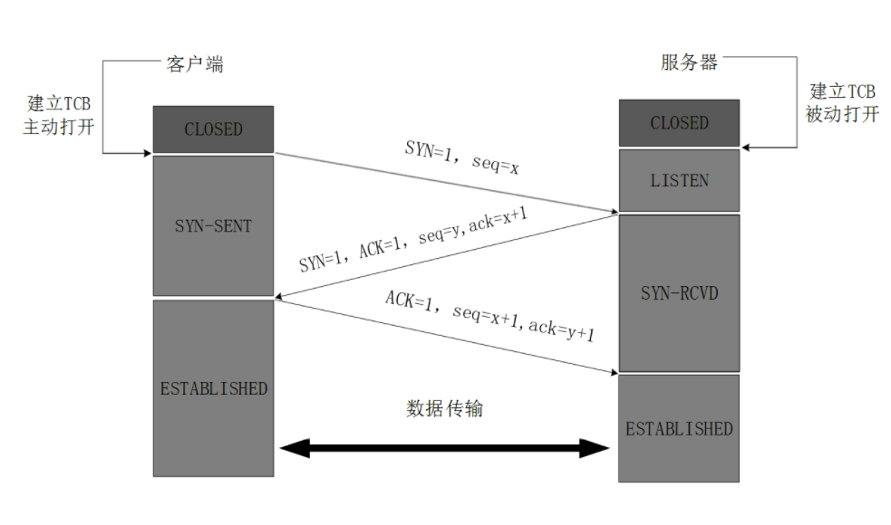
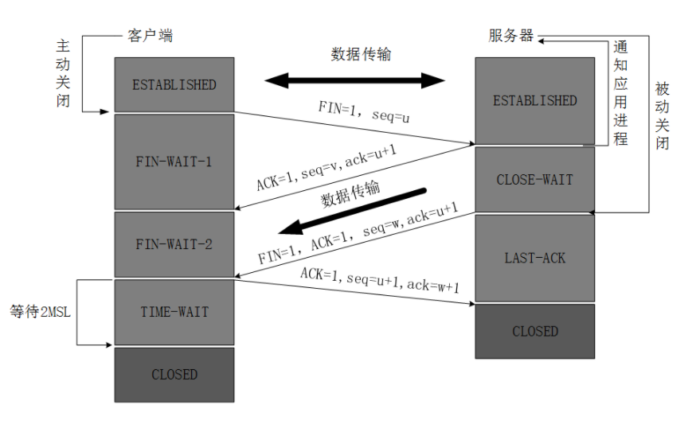
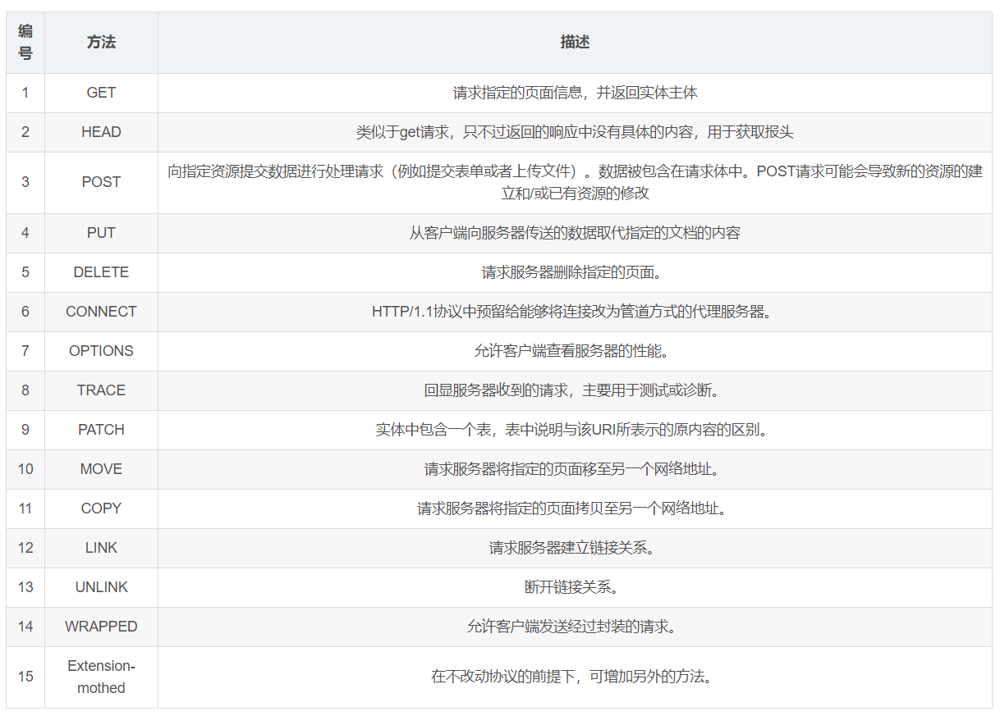
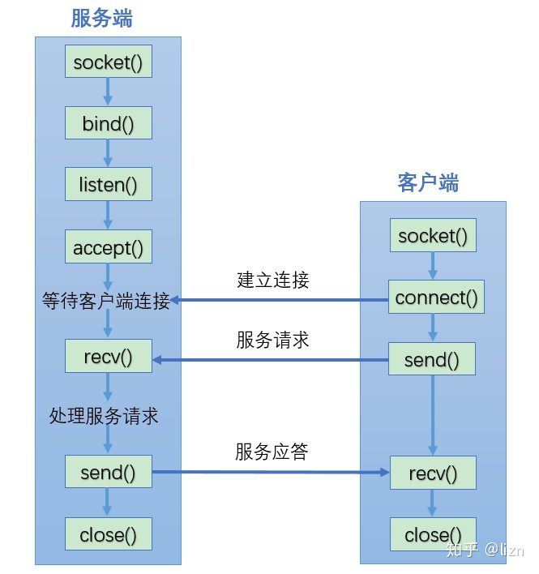
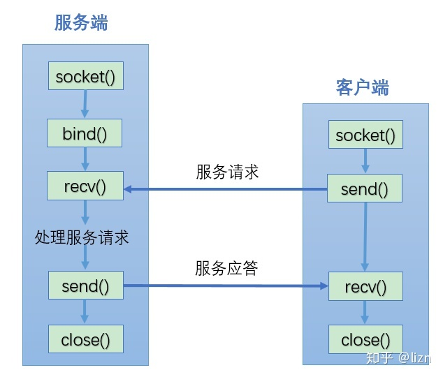

## 一、tcp & udp
UDP，在传送数据前不需要先建立连接，远地的主机在收到UDP报文后也不需要给出任何确认。虽然UDP不提供可靠交付，但是正是因为这样，省去和很多的开销，使得它的速度比较快，比如一些对实时性要求较高、减少初始开销的服务，就常常使用的是UDP。对应的应用层的协议主要有 DNS,TFTP,DHCP,SNMP,NFS 等。

TCP，提供面向连接的服务，在传送数据之前必须先建立连接，数据传送完成后要释放连接。因此TCP是一种可靠的的运输服务，但是正因为这样，不可避免的增加了许多的开销，比如确认，流量控制等。对应的应用层的协议主要有 SMTP,TELNET,HTTP,FTP 等。

TCP把连接作为最基本的对象，每一条TCP连接都有两个端点，这种端点我们叫作套接字（socket），它的定义为端口号拼接到IP地址即构成了套接字，例如，若IP地址为192.3.4.16 而端口号为80，那么得到的套接字为192.3.4.16:80。

tcp首部开销20字节，upd首部开销8字节。

### UDP实现可靠传输

UDP属于传输层，无法保证数据的可靠传输，为实现可靠传输只能通过应用层来实现了。实现的方式可以参照tcp可靠性传输的方式，只是实现不在传输层，实现转移到了应用层。

实现确认机制、重传机制、窗口确认机制。

如果你不利用linux协议栈以及上层socket机制，自己通过抓包和发包的方式去实现可靠性传输，那么必须实现如下功能：

         发送：包的分片、包确认、包的重发
    
         接收：包的调序、包的序号确认
    
         目前有如下开源程序利用udp实现了可靠的数据传输。分别为RUDP、RTP、UDT。
**RUDP**
RUDP 提供一组数据服务质量增强机制，如拥塞控制的改进、重发机制及淡化服务器算法等，从而在包丢失和网络拥塞的情况下， RTP 客户机（实时位置）面前呈现的就是一个高质量的 RTP 流。在不干扰协议的实时特性的同时，可靠 UDP 的拥塞控制机制允许 TCP 方式下的流控制行为。

### tcp三次握手过程

1. TCP服务器进程先创建传输控制块TCB，时刻准备接受客户进程的连接请求，此时服务器就进入了LISTEN（监听）状态；
2. TCP客户进程也是先创建传输控制块TCB，然后向服务器发出连接请求报文，这时报文首部中的同部位SYN=1，同时选择一个初始序列号 seq=x ，此时，TCP客户端进程进入了 SYN-SENT（同步已发送状态）状态。TCP规定，SYN报文段（SYN=1的报文段）不能携带数据，但需要消耗掉一个序号。
3. TCP服务器收到请求报文后，如果同意连接，则发出确认报文。确认报文中应该 ACK=1，SYN=1，确认号是ack=x+1，同时也要为自己初始化一个序列号 seq=y，此时，TCP服务器进程进入了SYN-RCVD（同步收到）状态。这个报文也不能携带数据，但是同样要消耗一个序号。
4. TCP客户进程收到确认后，还要向服务器给出确认。确认报文的ACK=1，ack=y+1，自己的序列号seq=x+1，此时，TCP连接建立，客户端进入ESTABLISHED（已建立连接）状态。TCP规定，ACK报文段可以携带数据，但是如果不携带数据则不消耗序号。
5. 当服务器收到客户端的确认后也进入ESTABLISHED状态，此后双方就可以开始通信了。


为什么TCP客户端最后还要发送一次确认呢？
一句话，主要防止已经失效的连接请求报文突然又传送到了服务器，从而产生错误。


第三次没有收到ACK包会怎样？

由于Server没有收到ACK确认，因此会重发之前的SYN+ACK（默认重发五次，之后自动关闭连接），Client收到后会重新传ACK给Server

### tcp四次挥手过程
（这里的客户端指的是主动发起关闭的一方，实际的服务器端也可以主动发起tcp连接的关闭，此时就成为了下述的客户端）

1. 客户端进程发出连接释放报文，并且停止发送数据。释放数据报文首部，FIN=1，其序列号为seq=u（等于前面已经传送过来的数据的最后一个字节的序号加1），此时，客户端进入FIN-WAIT-1（终止等待1）状态。 TCP规定，FIN报文段即使不携带数据，也要消耗一个序号。
2. 服务器收到连接释放报文，发出确认报文，ACK=1，ack=u+1，并且带上自己的序列号seq=v，此时，服务端就进入了CLOSE-WAIT（关闭等待）状态。TCP服务器通知高层的应用进程，客户端向服务器的方向就释放了，这时候处于半关闭状态，即客户端已经没有数据要发送了，但是服务器若发送数据，客户端依然要接受。这个状态还要持续一段时间，也就是整个CLOSE-WAIT状态持续的时间。
3. 客户端收到服务器的确认请求后，此时，客户端就进入FIN-WAIT-2（终止等待2）状态，等待服务器发送连接释放报文（在这之前还需要接受服务器发送的最后的数据）。
4. 服务器将最后的数据发送完毕后，就向客户端发送连接释放报文，FIN=1，ack=u+1，由于在半关闭状态，服务器很可能又发送了一些数据，假定此时的序列号为seq=w，此时，服务器就进入了LAST-ACK（最后确认）状态，等待客户端的确认。
5. 客户端收到服务器的连接释放报文后，必须发出确认，ACK=1，ack=w+1，而自己的序列号是seq=u+1，此时，客户端就进入了TIME-WAIT（时间等待）状态。注意此时TCP连接还没有释放，必须经过2 * MSL（最长报文段寿命）的时间后，当客户端撤销相应的TCB后，才进入CLOSED状态。
6. 服务器只要收到了客户端发出的确认，立即进入CLOSED状态。同样，撤销TCB后，就结束了这次的TCP连接。可以看到，服务器结束TCP连接的时间要比客户端早一些。


为什么建立连接是三次握手，关闭连接确是四次挥手呢？

建立连接的时候， 服务器在LISTEN状态下，**收到建立连接请求的SYN报文后，把ACK和SYN放在一个报文里发送给客户端。**
而关闭连接时，服务器收到对方的FIN报文时，仅仅表示对方不再发送数据了但是还能接收数据，而自己也未必全部数据都发送给对方了，所以**己方可以立即关闭，也可以发送一些数据给对方后，再发送FIN报文给对方来表示同意现在关闭连接，因此，己方ACK和FIN一般都会分开发送，从而导致多了一次。**

time-wait的作用？
1. 可靠的实现全双工tcp连接的终止：time-wait期间，在进行关闭连接四次挥手协议时，最后的ACK是由服务端发出的，如果这个最终的ACK丢失，服务器将重发最终的FIN，
因此客户端必须维护状态信息允许它重发最终的ACK，保证四次挥手四次分节的正常发送与被接收。
2. 使老的重复分节在网络中消失：在关闭连接的四次挥手期间，发送的数据分节可能由于网络的原因在网络中滞留，如果不保持2msl长的time-wait时间，后面紧接启动的tcp连接会接收到上一次tcp关闭连接的分节而产生错误。

拥有time-wait实现上述两点，当然也产生了一个问题，如果有大量的time-wait如何处理呢？
在大量的短连接业务下，time-wait会大量的出现，从而占用端口资源，出现在客户端的话会造成客户端没有新的端口资源发起请求，出现在服务端的话会造成服务不可以用，利用nginx服务器报错cannot assign requested address

解决大量的time-wait状态：
1. 可以考虑将大量的短连接业务用长连接代替，减少不必要的握手和挥手
2. 服务器可以设置SO_REUSEADDR套接字选项来通知内核，如果端口忙，但TCP连接位于TIME_WAIT状态时可以重用端口。

close-wait的作用？
给被动关闭方有时间继续发送未发送完的数据，如果被动关闭方已经发送完数据但是自己还需要处理读写等业务，此时应该先关闭close-wait状态进入到last-ack状态而不是等处理完业务再进入下一个状态，否则会使被动关闭方出现大量的close-wait状态，拖累被动关闭方的性能。

### 试图与一个不存在的端口建立连接

试图与一个不存在的端口建立连接时，符合触发RST分节的条件，目的为某端口的SYN分节到达，而端口没有监听，那么内核会立即响应一个RST，表示出错。客户端TCP收到这个RST之后则放弃这次连接的建立，并且返回给应用程序一个错误。正如上面所说，建立连接的过程对应用程序来说是不可见的，这是操作系统帮我们来完成的，所以即使进程没有启动，也可以响应客户端。

### 试图与一个不存在的主机上面的某个端口建立连接

这也是一种比较常见的情况，当某台服务器主机宕机了，而客户端并不知道，仍然尝试去与其建立连接。这个时候由于宕机，操作系统帮不上忙，服务器处于一种完全没有响应的状态。那么此时客户端的TCP会怎么办呢？客户端不会收到任何响应，那么等待6s之后再发一个SYN，若无响应则等待24s之后再发一个，若总共等待了75s后仍未收到响应就会返回ERR_CONNECTION_TIMED_OUT错误。这是TCP建立连接自己的一个保护机制，但是我们要等待75s才能知道这个连接无法建立，对于我们所有服务来说都太长了。更好的做法是在代码中给connect设置一个超时时间。

### Server进程被阻塞

由于某些情况，服务器端进程无法响应任何请求，比如所在主机的硬盘满了，导致进程处于完全阻塞，通常我们测试时会用gdb模拟这种情况。上面提到过，建立连接的过程对应用程序是不可见的，那么，这时**连接可以正常建立**。当然，客户端进程也可以通过这个连接给服务器端发送请求，**服务器端TCP会应答ACK表示已经收到这个分节**（这里的收到指的是数据已经在内核的缓冲区里准备好，由于进程被阻塞，无法将数据从内核的缓冲区复制到应用程序的缓冲区），**但永远不会返回结果。**

### Server进程被杀死（相当于服务端主动退出，指的不是宕机）

这是线上最常见的操作，当一个模块上线时，OP同学总是会先把旧的进程杀死，然后再启动新的进程。那么在这个过程中TCP连接发生了什么呢。在进程正常退出时会自动调用close函数来关闭它所打开的文件描述符，这相当于服务器端来主动关闭连接——会发送一个FIN分节给客户端TCP；客户端要做的就是配合对方端口来关闭连接，TCP会自动响应一个ACK，然后再由客户端应用程序调用close函数，也就是我们上面所描述的关闭连接的4次挥手过程。接下来，**客户端还需要定时去重连，以便当服务器端进程重新启动好时客户端能够继续与之通信。**

### 连接过程中，突然Server进程所在的主机宕机

客户端向服务器端发送分节，由于服务器端宕机，不会有任何响应，**客户端持续重传，然而服务器始终不能应答，重传数次之后，大约4~10分钟才停止，**之后返回一个ETIMEDOUT错误。

### tcp确认机制、重传机制、窗口确认机制

**重传策略**
TCP协议用于控制数据段是否需要重传的依据是设立重发定时器。在发送一个数据段的同时启动一个重传，如果在重传超时前收到确认(Acknowlegement)就关闭该重传，如果重传超时前没有收到确认，则重传该数据段。在选择重发时间的过程中，TCP必须具有自适应性。它需要根据互联网当时的通信情况，给出合适的重发时间。

这种重传策略的关键是对定时器初值的设定。采用较多的算法是Jacobson于1988年提出的一种不断调整超时时间间隔的动态算法。其工作原理是：对每条连接TCP都保持一个变量RTT（Round Trip Time），用于存放当前到目的端往返所需要时间最接近的估计值。当发送一个数据段时，同时启动连接的定时器，如果在定时器超时前确认到达，则记录所需要的时间（M），并修正[2]  RTT的值，如果定时器超时前没有收到确认，则将RTT的值增加1倍。通过测量一系列的RTT（往返时间）值，TCP协议可以估算数据包重发前需要等待的时间。在估计该连接所需的当前延迟时通常利用一些统计学的原理和算法（如Karn算法），从而得到TCP重发之前需要等待的时间值。


## 二、tcp粘包
1 什么是粘包现象
　　TCP粘包是指发送方发送的若干包数据到接收方接收时粘成一包，从接收缓冲区看，后一包数据的头紧接着前一包数据的尾。

2 为什么出现粘包现象
　　（1）发送方原因

　　我们知道，**TCP默认会使用Nagle算法**。而Nagle算法主要做两件事：1）**只有上一个分组得到确认，才会发送下一个分组；2）收集多个小分组，在一个确认到来时一起发送。**

　　所以，正是**Nagle算法造成了发送方有可能造成粘包现象**。

　　（2）接收方原因

　　TCP接收到分组时，并不会立刻送至应用层处理，或者说，应用层并不一定会立即处理；实际上，TCP将收到的分组保存至接收缓存里，然后应用程序主动从缓存里读收到的分组。这样一来，如果**TCP接收分组的速度大于应用程序读分组的速度，多个包就会被存至缓存，应用程序读时，就会读到多个首尾相接粘到一起的包。**

3 解决方案

解决问题的关键在于如何给每个数据包添加边界信息，常用的方法有如下几个：

 1、发送端给每个数据包添加包首部，首部中应该至少包含数据包的长度，这样接收端在接收到数据后，通过读取包首部的长度字段，便知道每一个数据包的实际长度了。

 2、发送端将每个数据包封装为固定长度（不够的可以通过补0填充），这样接收端每次从接收缓冲区中读取固定长度的数据就自然而然的把每个数据包拆分开来。

 3、可以在数据包之间设置边界，如添加特殊符号，这样，接收端通过这个边界就可以将不同的数据包拆分开。

## 三、ssl握手
1. 客户端将它所支持的算法列表和一个用作产生密钥的随机数发送给服务器；
2. 服务器从算法列表中选择一种加密算法，并将它和一份包含服务器公用密钥的证书发送给客户端；该证书还包含了用于认证目的的服务器标识，服务器同时还提供了一个用作产生密钥的随机数；
3. 客户端对服务器的证书进行验证(有关验证证书，参考下面一点)，并抽取服务器的公用密钥；然后，再产生一个称作pre_master_secret的随机密码串，并使用服务器的公用密钥对其进行加密(参考非对称加/解密)，并将加密后的信息发送给服务器；
4. 客户端与服务器端根据pre_master_secret以及客户端与服务器的随机数值独立计算出加密和MAC密钥(参考DH密钥交换算法)。
5. 客户端将所有握手消息的MAC值发送给服务器；
6. 服务器将所有握手消息的MAC值发送给客户端。

### 怎样保证拿到的证书是正确的，即验证证书
1. 服务端向CA机构申请数字证书，CA机构签发证书,
证书持有者的个人信息+证书信息+证书持有者的公钥——>CA签发机构的私钥=数字证书
2. 服务端再发送内容的时候，比如发送ABC
Hash算法+ABC——>数字摘要+服务端的私钥——>数字签名
数字证书+数字签名+ABC——>发送内容
3. 客户端接收到以后，
先去浏览器的CA证书列表验证数字证书的可用性，比如真伪，是否过期等
如果可信，就用对应的CA机构的公钥解密数字证书从而获取服务端的公钥，
然后通过服务端的公钥解密数字签名获取数字摘要，
然后通过相同的hash算法处理ABC得到数字摘要，
然后通过两个数字摘要进行对比就能确定内容是否被篡改过。
4. 如果没有被篡改过，即证书是正确安全的，开始后面的对称加密。


## 四、http
### http请求方法



### http状态码
1xx：代表请求已被接受，需要继续处理。这类响应是临时响应，只包含状态行和某些可选的响应头信息，并以空行结束。

2xx：请求已成功被服务器接收、理解、并处理。

3xx：该类状态码代表需要客户端采取进一步的操作才能完成请求。通常，这些状态码用来重定向，后续的请求地址（重定向目标）在本次响应的Location域中指明。当且仅当后续的请求所使用的方法是GET或者HEAD时，用户浏览器才可以在没有用户介入的情况下自动提交所需要的后续请求。客户端应当自动监测无限循环重定向（例如：A->A，或者A->B->C->A），因为这会导致服务器和客户端大量不必要的资源消耗。按照 HTTP/1.0 版规范的建议，浏览器不应自动访问超过5次的重定向。
主要记住300是多个选择列表，301是永久重定向，302是暂时重定向

4xx：这类的状态码代表了客户端看起来可能发生了错误，妨碍了服务器的处理。除非响应的是一个HEAD请求，否则服务器就应该返回一个解释当前错误状况的实体，以及这是临时的还是永久性的状况。这些状态码适用于任何请求方法。浏览器应当向用户显示任何包含在此类错误响应中的实体内容。
主要记住400是请求语法出错，401是未授权，输入账号密码可以进一步进行请求，403是forbiden禁止，直接no permission, 404 not found

5xx：这类状态码代表了服务器在处理请求的过程中有错误或者异常状态发生，也有可能是服务器意识到以当前的软硬件资源无法完成对请求的处理。
主要记住500internal server error, 501 not implemented, 502 bad gateway, 503 service unavailable

### http数据包

 HTTP由请求和响应两部分组成，所以对应的也有两种报文格式。下面分别介绍HTTP请求报文格式和HTTP响应报文格式。

      HTTP请求报文格式


        以上表格中，第1行为“请求行”，第2、3、4行为“请求头部”，第5行为空行，第6行为“请求正文”。分别介绍这4部分：
    
      1.请求行：由3部分组成，分别为：请求方法、URL（见备注1）以及协议版本，之间由空格分隔，请求方法包括GET、POST等。协议版本的格式为：HTTP/主版本号.次版本号，常用的有HTTP/1.0和HTTP/1.1。
    
      2.请求头部包含很多客户端环境以及请求正文的有用信息。请求头部由“关键字：值”对组成，每行一堆，关键字和值之间使用英文“：”分隔。
    
      3.空行，这一行非常重要，必不可少。表示请求头部结束，下面就是请求正文。
    
      4.请求正文：可选部分，比如GET请求就没有请求正文；POST比如以提交表单数据方式为请求正文。
    
    HTTP响应报文格式：


        以上表格中，第1行为“状态行”，第2、3、4行为“响应头部”，第5行为空行，第6行为“响应正文”。下面分别介绍这4部分：
    
      (1)状态行由由3部分组成，分别为：协议版本，状态码，状态码描述，之间由空格分隔。状态代码为3位数字，200~299的状态码表示成功，300~399的状态码指资源重定向，400~499的状态码指客户端请求出错，500~599的状态码指服务端出错（HTTP/1.1向协议中引入了信息性状态码，范围为100~199）
      (2)响应头部与请求头部类似，也包含了很多有用的信息。
    
      (3)空行，这一行非常重要，必不可少。表示响应头部结束
    
      (4)响应正文，服务器返回的文档，最常见的为HTML网页。

2. HTTP的头域
      在HTTP的请求消息和应答消息中，都包含头域。头域分为4种，其中请求头域和应答头域分别只在请求消息和应答消息中出现，通用头域和实体头域在两种消息中都可以出现，但实体头域只有当消息中包含了实体数据时才会出现。下面分别介绍这4种头域中的域名城和功能。

      HTTP请求头域

​    


      应答头域只在应答消息中出现，是Web服务器向浏览器提供的一些状态和要求。如下
    
      HTTP 应答头域

 


      通用头域既可以用在请求消息中，也可以用在应答消息。
    
      HTTP通用头域


​      

         只有在请求和应答消息中包含实体数据时，才需要实体头域。请求消息中的实体数据是一些由浏览器向web服务器提交的数据，如在浏览器中采用POST方式提交表单时，浏览器就要把表单中的数据封装在请求消息的实体数据部分。应答消息中的实体数据是web服务器发给浏览器的媒体数据，如网页，图片和文档等。实体头域说明了实体数据的一些属性。如下表
    
      HTTP实体头域


​     

### 幂等性

从逻辑学的角度理解

```matlab
p = p ^ p
```

从数学的角度理解

```matlab
f(f(x)) = f(x)
```

简单来说，幂等这个概念指的是多次同样的操作而不改变结果。幂等的概念广泛运用于各种分布式架构，由于网络延迟等原因，一个请求可能要多次重试，遇到这种情况就需要保证这个对应的请求接口是幂等的。另外还有类似银行转账的情形，就算多次请求也要保证对账户只做一次操作。

### HTTP 协议的幂等性

以我们常见的四种 HTTP method 为例，加深我们对幂等这个概念的理解。

#### GET

GET 操作是幂等的，原因是 GET 操作根本不会对服务器产生任何修改。有人可能会说我们访问 GET /last_news 可能每次拿到的结果都不一样，这里幂等的一致性指的是数据库的最终的存储结果，而不是调用方拿到的返回结果

#### PUT

PUT 方法通常是对已经存在的资源进行修改，也是幂等的。比如我们发起多个把 A 替换成 B 的请求，最终的结果还会是 B

#### DELETE

DELETE 方法也是幂等的，例如我们连续发起多个对 A 的删除请求，如果第一个成功的话，后面的请求都应返回资源找不到的错误

#### POST

POST 一般是指新增资源，不是幂等的。如果连续发起三个 A 资源的增加，最终的结果会是三个 A 资源，而不是一个socket

### socket如何分别连接tcp, udp

TCP通信socket编程



UDP通信socket编程



从上两图进行比较可以看出，对于面向连接的可靠传输TCP来说，在socket通信编程时服务端会比非连接的不可靠传输UDP协议多了个listen和accept状态，而客户端多了connect状态，这都是TCP用来建立连接的。

### http 2.0和1.1的区别

- **新的二进制格式**（Binary Format），HTTP1.x的解析是基于文本。基于文本协议的格式解析存在天然缺陷，文本的表现形式有多样性，要做到健壮性考虑的场景必然很多，二进制则不同，只认0和1的组合。基于这种考虑HTTP2.0的协议解析决定采用二进制格式，实现方便且健壮。
- **多路复用**（MultiPlexing），即连接共享，即每一个request都是是用作连接共享机制的。一个request对应一个id，这样一个连接上可以有多个request，每个连接的request可以随机的混杂在一起，接收方可以根据request的 id将request再归属到各自不同的服务端请求里面。
- **header压缩**，HTTP1.x的header带有大量信息，而且每次都要重复发送，HTTP2.0使用encoder来减少需要传输的header大小，通讯双方各自cache一份header fields表，既避免了重复header的传输，又减小了需要传输的大小。
- **服务端推送**（server push），同SPDY一样，HTTP2.0也具有server push功能。

## 六、网路安全

### xss攻击

Cross Site Scripting，跨站脚本，是发生在目标用户的浏览器层面上的，当渲染DOM树的过程发生了不在预期内执行的JS代码时，就发生了XSS攻击。XSS攻击的主要方式是嵌入一段远程或者第三方域上的JS代码。主要有以下几种：

反射型XSS 

反射型XSS，也叫非持久型XSS，是指发生请求时，XSS代码出现在请求URL中，作为参数提交到服务器，服务器解析并响应，响应结果包含XSS代码，最后浏览器解析执行，数据不经过后端数据库等存储系统，由于这个过程像一次反射，故称为反射型xss。

存储型xss

 存储型xss和反射型xss唯一的区别在于存储型xss的代码会保存在后端数据存储系统诸如数据库文件系统中，在下一次发出请求时xss攻击代码返回到浏览器从而进一步执行发生攻击，由于会攻击代码会储存在后端系统中，发生多次的攻击，属于持久型xss。

DOM xss

dom xss和上面两种攻击方式的区别在dom xss攻击不需要后端服务器的参与，完全是在客户端浏览器层面上的攻击。

### csrf攻击

cross site request forgery，跨站请求伪造，即攻击者盗用你的身份，以你的名义发送恶意请求。一般有两个步骤，用户登录受信任网站A，并在本地生成cookie；在不退出A网站的情况下，访问危险网站B，从而获取A网站中的cookie信息。

防御

服务器端防御：

　　1、重要数据交互采用POST进行接收，当然是用POST也不是万能的，伪造一个form表单即可破解

　　2、使用验证码，只要是涉及到数据交互就先进行验证码验证，这个方法可以完全解决CSRF。但是出于用户体验考虑，网站不能给所有的操作都加上验证码。因此验证码只能作为一种辅助手段，不能作为主要解决方案。

　　3、验证HTTP Referer字段，该字段记录了此次HTTP请求的来源地址，最常见的应用是图片防盗链。PHP中可以采用APache URL重写规则进行防御，可参考：http://www.cnblogs.com/phpstudy2015-6/p/6715892.html

　　4、为每个表单添加令牌token并验证

（可以使用cookie或者session进行构造。当然这个token仅仅只是针对CSRF攻击，在这前提需要解决好XSS攻击，否则这里也将会是白忙一场【XSS可以偷取客户端的cookie】） 

　　CSRF攻击之所以能够成功，是因为攻击者可以伪造用户的请求，该请求中所有的用户验证信息都存在于Cookie中，因此攻击者可以在不知道这些验证信息的情况下直接利用用户自己的Cookie来通过安全验证。由此可知，抵御CSRF攻击的关键在于：在请求中放入**攻击者所不能伪造的信息**，并且该信息不存在于Cookie之中。

　　鉴于此，我们将为每一个表单生成一个随机数秘钥，并在服务器端建立一个拦截器来验证这个token，如果请求中没有token或者token内容不正确，则认为可能是CSRF攻击而拒绝该请求。

　　由于这个token是随机不可预测的并且是隐藏看不见的，因此恶意攻击者就不能够伪造这个表单进行CSRF攻击了。

　　要求：

　　1、要确保同一页面中每个表单都含有自己唯一的令牌

　　2、验证后需要删除相应的随机数

### ddos攻击

对服务器的不同端口发送巨型流量的UDP报文，无法通关关闭端口的方式来进行隔离，破坏力极强，严重会造成服务器当机。

根据攻击的时间和方式又可分将DDOS为以下几种

1.SYN Flood


2.ACK Flood


3.Connection Flood


4.HTTP Get Flood


对TCP饿死的应对方案

1.增加带宽，堵死了再买

2.CDN，各地部署子服务器，当子服务遭受到攻击时，其他地区的服务器和主服务器不会受到影响。

3.BGP流量清洗，通过BGP将通道内的无用UDP报文清洗干净再转给服务器

## 七、网络抓包

### 1. 为什么要抓包

1. 定位网络接口问题

2. 分析其他App数据接口

3. 学习网络协议，使用抓包工具分析网络数据更直观 

大部分场合都可以通过程序调试来定位问题，但有些场景使用抓包来定位接口问题更准确、更方便，如以下场景：

* 你发送数据给后台，但后台没有收到，可以对接口进行抓包分析，看是后台处理有问题，还是App没有将数据发出去，或是App发送数据格式有误

* 你和后台接口联调测通，但业务数据对不上，你认为是后台问题，后台认为是你发的问题，可以抓包确认问题所在

* 线上App出现bug需要定位，但你没在公司，没有代码可调试，可直接抓包分析

* App页面渲染缓慢，抓包看下接口响应时长，是不是后台出现性能问题

* 需要测试弱网环境下App的体验？抓包工具可设置流量限制，可设置接口堵塞

* 想改变某接口的响应报文？想多次重发某一请求，但App业务流程有限制？可以试试抓包工具提供的功能

### 2. 抓包的原理

要实现对App的网络数据抓包，需要监控App与服务器交互之间的网络节点，监控其中任意一个网络节点（网卡），获取所有经过网卡中的数据，对这些数据按照网络协议进行解析，这就是抓包的基本原理。

但是中间网络节点，不受我们控制，所以基本无法实现抓包的，只能在客户端和服务端进行抓包。

## 八、dns解析过程

当一个用户在地址栏输入www.taobao.com时，DNS解析有大致十个过程，如下：


\1. 浏览器先检查自身缓存中有没有被解析过的这个域名对应的ip地址，如果有，解析结束。同时域名被缓存的时间也可通过TTL属性来设置。

\2. 如果浏览器缓存中没有（专业点叫还没命中），浏览器会检查操作系统缓存中有没有对应的已解析过的结果。而操作系统也有一个域名解析的过程。在windows中可通过c盘里一个叫hosts的文件来设置，如果你在这里指定了一个域名对应的ip地址，那浏览器会首先使用这个ip地址。

但是这种操作系统级别的域名解析规程也被很多黑客利用，通过修改你的hosts文件里的内容把特定的域名解析到他指定的ip地址上，造成所谓的域名劫持。所以在windows7中将hosts文件设置成了readonly，防止被恶意篡改。

\3.  如果至此还没有命中域名，才会真正的请求本地域名服务器（LDNS）来解析这个域名，这台服务器一般在你的城市的某个角落，距离你不会很远，并且这台服务器的性能都很好，一般都会缓存域名解析结果，大约80%的域名解析到这里就完成了。

\4. 如果LDNS仍然没有命中，就直接跳到Root Server 域名服务器请求解析

\5. 根域名服务器返回给LDNS一个所查询域的主域名服务器（gTLD Server，国际顶尖域名服务器，如.com .cn .org等）地址

\6. 此时LDNS再发送请求给上一步返回的gTLD

\7. 接受请求的gTLD查找并返回这个域名对应的Name Server的地址，这个Name Server就是网站注册的域名服务器

\8. Name Server根据映射关系表找到目标ip，返回给LDNS

\9. LDNS缓存这个域名和对应的ip

\10. LDNS把解析的结果返回给用户，用户根据TTL值缓存到本地系统缓存中，域名解析过程至此结束


## 九、Ping过程细节

 ping命令是用来查看网络上另一个主机系统的网络连接是否正常的一个工具。ping命令的工作原理是：向网络上的另一个主机系统发送ICMP报文，如果指定系统得到了报文，它将把报文一模一样地传回给发送者。ICMP（网际控制报文协议）：这是IP层的一个协议，但是由于差错报告在发送给报文源发方时可能也要经过若干子网，因此牵涉到路由选择等问题，所以ICMP报文需通过IP协议来发送。ICMP数据报的数据发送前需要两级封装：首先添加ICMP报头形成ICMP报文，再添加IP报头形成IP数据报。由于IP层协议是一种点对点的协议，而非端对端的协议，它提供无连接的数据报服务。

网络故障时候，我们一般采用四个步骤：

> - **1. ping localhost:**
>   localhost的IP地址一般为127.0.0.1, 也称loopback(环回路由)；如果此时ping不通，则表示协议栈有问题；ping 该地址不经过网卡，仅仅是软件层面
> - **2. ping 本机IP：**
>   ping 本机IP其实是从驱动到网卡，然后原路返回；所以如果此时ping不通，则表示网卡驱动有问题，或者NIC硬件有问题；
> - **3. ping 网关：**
>   所谓网关，就是连接到另外一个网络的“关卡”， 一般为离我们终端最近的路由器；可以使用`ipconfig (windows)`或`ifconfig (Linux)`查看；若此时ping不通，则为主机到路由器间的网络故障；
> - **4. ping 目的IP:**
>   若此步骤不成功，应该就是路由器到目的主机的网络有问题

## 十、ARP

地址解析协议，即ARP（Address Resolution Protocol），是根据[IP地址](https://baike.baidu.com/item/IP地址)获取[物理地址](https://baike.baidu.com/item/物理地址/2129)的一个[TCP/IP协议](https://baike.baidu.com/item/TCP%2FIP协议)。[主机](https://baike.baidu.com/item/主机/455151)发送信息时将包含目标IP地址的ARP请求广播到局域网络上的所有主机，并接收返回消息，以此确定目标的物理地址；收到返回消息后将该IP地址和物理地址存入本机ARP缓存中并保留一定时间，下次请求时直接查询ARP缓存以节约资源。地址解析协议是建立在网络中各个主机互相信任的基础上的，局域网络上的主机可以自主发送ARP应答消息，其他主机收到应答报文时不会检测该报文的真实性就会将其记入本机ARP缓存；由此攻击者就可以向某一主机发送伪ARP应答报文，使其发送的信息无法到达预期的主机或到达错误的主机，这就构成了一个[ARP欺骗](https://baike.baidu.com/item/ARP欺骗)。


